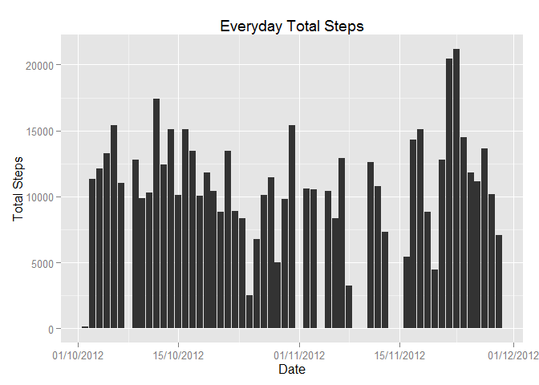
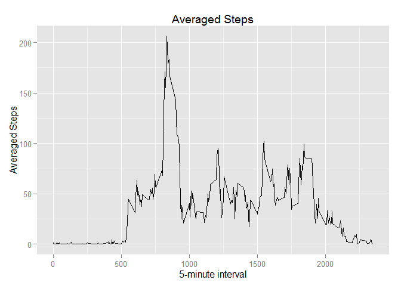
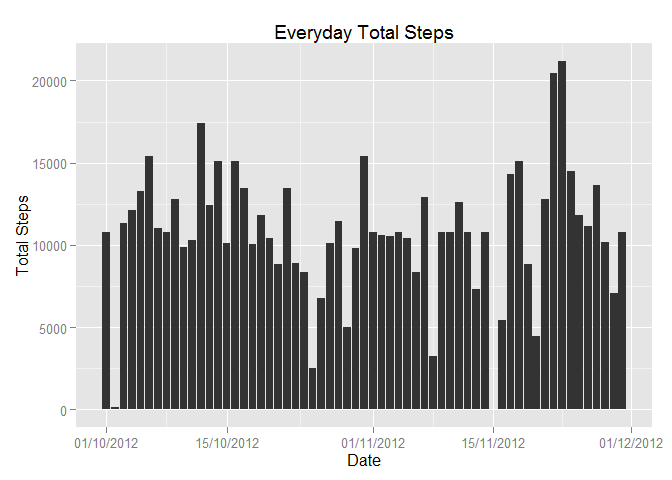
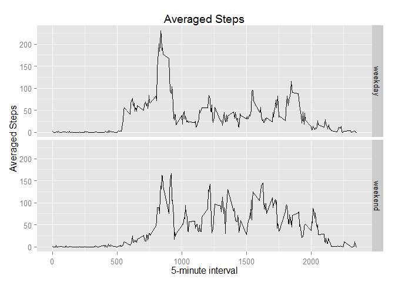

# Reproducible Research: Peer Assessment 1
##Loading and preprocessing the data


```r
library(ggplot2)
library(scales)
setwd("e://rwork")
dat<-read.csv('activity.csv')
dat$date<-as.POSIXct(as.character(dat$date))
dat_na<-dat
na_num=nrow(dat)
dat<-na.omit(dat)
na_num=na_num-nrow(dat)
dat1<-aggregate(dat$steps,by=list(dat$date),sum )
dat2<-aggregate(dat$steps,by=list(dat$interval),mean )
```

##What is mean total number of steps taken per day?

- Mean is 1.0766189\times 10^{4}
- Median is 10765


```r
pls<-ggplot(dat1,aes(x=Group.1,y=x))+geom_histogram(stat='identity')+
    labs(title = "Everyday Total Steps",x = "Date",y = "Total Steps")+
    scale_x_datetime(labels = date_format("%d/%m/%Y"))
pls
```

 

##What is the average daily activity pattern?

835  5-minute intervals, on average across all the days in the dataset, contains the maximum number of steps.


```r
pls<-ggplot(dat2,aes(x=Group.1,y=x))+geom_line()+labs(title = "Averaged Steps",x = "5-minute interval",y = "Averaged Steps")
pls
```

 

##Imputing missing values

The dataset has a total of 2304 missing value.
Every NA value was replaced by corresponding average steps for that 5-minute interval.


```r
dict=list()
for (i in 1:nrow(dat2)){
    dict[as.character(dat2[i,1])]=dat2[i,2]
}
for (i in 1:nrow(dat_na)){
    if (is.na(dat_na[i,1])){
        dat_na[i,1]=dict[[as.character(dat_na[i,3])]]
    }
}
dat_no_na<-dat_na
dat_no_na1<-aggregate(dat_no_na$steps,by=list(dat_no_na$date),sum )
pls<-ggplot(dat_no_na1,aes(x=Group.1,y=x))+geom_histogram(stat='identity')+
    labs(title = "Everyday Total Steps",x = "Date",y = "Total Steps")+
    scale_x_datetime(labels = date_format("%d/%m/%Y"))
pls
```

 

- The mean of new dataset is 1.0766189\times 10^{4}
- The median of new dataset is 1.0766189\times 10^{4}

There is not too much differences between datasest with and without NA values.
For the method employed to replace NA values, there is no on the estimates of the total daily number of steps.

##Are there differences in activity patterns between weekdays and weekends?

It seems more steps found in weekends than weekday as a whole. However, weekday enjoys more steps in morning.


```r
week=ifelse(weekdays(dat_na[,2])=="星期六"|weekdays(dat_na[,2])=="星期日","weekend","weekday")
newdat=aggregate(dat_na$steps,by=list(dat_na$interval,week),mean)
pls<-ggplot(newdat,aes(x=Group.1,y=x))+geom_line()+facet_grid(Group.2~.)+labs(title = "Averaged Steps",x = "5-minute interval",y = "Averaged Steps")
pls
```

 

